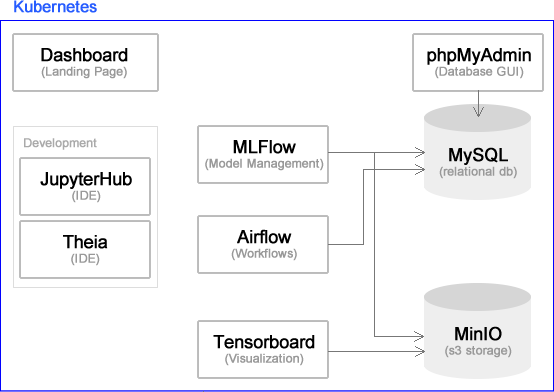
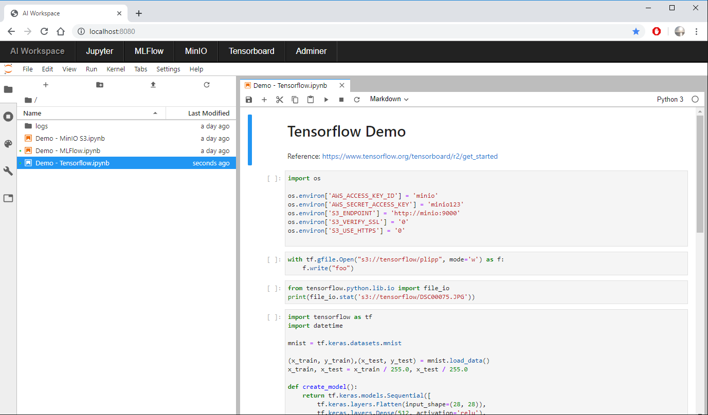

# AI Workspace



## Table of contents

- [1. Description](#1-description)
- [2. Getting Started](#2-getting-started)
    - [2.1. Docker Compose](#21-docker-compose)
    - [2.2. Kubernetes](#22-kubernetes)
        - [Configuration](#configuration)
- [3. Components](#3-components)
- [4. Customize Dev Environment](#4-customize-dev-environment)

## 1. Description 

Use __AI workspace__ to build productive AI solutions.
<br><br>
This repository is a spin-off of a private project, where I use machine learning to predict stock prices and encaspsulate different steps of Model Lifecycle Management in services 
- data ingestion
- preprocessing
- model development
- model training with hyperparameter tuning and experiment tracking
- model deployment
- model monitoring 
- scheduled re-training
 
Building professional AI solutions means, that your results are reproducable, auditable and scalable on a Cloud infrastructure. __AI Workspace__ targets these challenges with Open Source tools running as services in Docker or Kubernetes.
 


### Shortcut *aiw*

__AI workspace__ is used via bash script "./aiw.sh". You can create an alias with the following shortcut

```bash
alias aiw="$(pwd)/aiw.sh"

# Test
aiw
``` 

## 2. Getting started

```bash
# build the images first
aiw build
```

 
There are two options to use the AI Workspace: locally with Docker Compose or on a Kubernetes Cluster.

### 2.1. Docker Compose

Environment variables can be setted in ``.env``.<br>
Clone this repository. Then move or copy all your stuff (notebooks, code) to the directory ``workspace/``. This is the starting directory, which can be changed in the ``.env`` file.

```bash
# Make sure docker-compose is installed and ./aiw.sh is executable

# Starts all services
aiw up

# Restarts all services
aiw restart

# Stops all services
aiw stop

# Stops all services and removes them.
# Volumes (+ data) will persist.
aiw down

# Removes everything, even volumes - be careful!
aiw purge
```


### 2.2. Kubernetes

You need a running Kubernetes Cluster and Helm.

```bash
# Create ingress controller
aiw kube ns ingress

# Init or set a Kubernetes namespace
aiw kube ns ai-workspace

# Starts all services
aiw kube install

# Remove all services
aiw kube uninstall
```

#### Configuration

You can enable or disable service in the Values file: `kubernetes/values.yaml`

```
dashboard:
    enabled: true
jupyterhub:
    enabled: true
mlflow:
    enabled: true
phpmyadmin:
    enabled: true
mysql:
    enabled: true
minio:
    enabled: true
airflow:
    enabled: true
theia:
    enabled: true
tensorboard:
    enabled: true
```

## 3. Components 
Make sure that the ports are not taken.<br>

---
|Service|Docker Compose|Kubernetes|Function|
|-|-|-|-|
|**Dashboard**|http://localhost:8080 |http://localhost |AI Workspace Landing Page|
|**[JupyterLab/Hub](https://github.com/jupyterlab/jupyterlab)**|http://localhost:8888 |http://localhost/hub|Browser-based development environment|
|**[Theia](https://github.com/theia-ide/theia-apps)**||http://localhost/ide|Browser-based development environment|
|**[MLFlow](https://github.com/mlflow/mlflow)**|http://localhost:5000 |http://localhost/mlflow|Machine Learning Lifecycle Platform for tracking experiments and runs, evaluating models, parameters and metrics|
|**[Airflow](https://github.com/apache/airflow)**|http://localhost:8070 |http://localhost/airflow|A platform to programmatically author, schedule, and monitor workflows|
|**[Tensorboard](https://github.com/tensorflow/tensorboard)**|http://localhost:6006 |http://localhost/tensorboard|TensorFlow's Visualization Toolkit|
|**[MinIO](https://github.com/minio/minio)**|http://localhost:9000 |http://localhost/minio|S3 object storage in order to store artifacts from MLFlow or training data|
|**[MySQL](https://github.com/mysql/mysql-server)**|http://localhost:3306 ||Relational database|
|**[phpmyadmin](https://github.com/phpmyadmin/phpmyadmin)**|http://localhost:8890 |http://localhost/phpmyadmin|Browser-based database management tool|

## 4. Customize Dev Environment

```
|-tools
|--jupyter
|---requirements.txt
```

When you first start the AI Workspace it builds an image for JupyterLab with predefined Python packages (tensorflow). You can easily add your necessary packages in the file ``tools/jupyter/requirements.txt``.

As your project grows and the need for more Python packages, just delete the Docker image ``ai-workspace-jupyterlab``, adjust ``requirements.txt`` and restart the AI Workspace.

Deleting and rebuilding the image does not affect the code and work results which are persistent stored in ``WORKSPACE_DIR``.

 