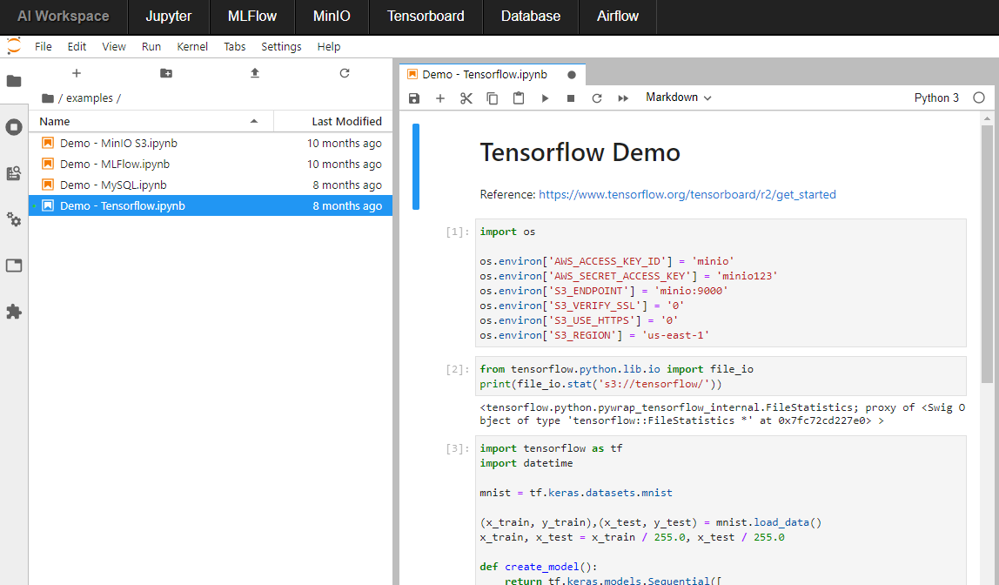

# AI Workspace

## 1. Description 


<br>
AI workspace is a dev development environment for professional machine learning built on Open Source tools. The project targets several objectives:
- encapsulate services and entities efficiently (data, code, artifacts)
- historize performance of ML models
- make results reproducable
- prepare your AI project for a Cloud infrastructure
All services run in Docker containers. 

### Prerequisites

- Docker
- Docker Compose 
- Kubernetes 
- Helm

### Shortcut *aiw*

The AI workspace is handled over the bash script "./aiw.sh". In order to create a shortcut to this command, we need an alias

```bash
alias aiw="$(pwd)/aiw.sh"

# Test
aiw
``` 

## 2. Getting started

```bash
# build the images first
aiw build
```

Environment variables can be setted in ``.env``.<br>
 
There are two options to use the AI Workspace: locally with Docker Compose or on a Kubernetes Cluster.

### 2.1. Docker Compose

Clone this repository. Then move or copy all your stuff (notebooks, code) to the directory ``workspace/``. This is the starting directory. You can change it in the ``.env`` file.

```bash
# Make sure docker-compose is installed and ./aiw.sh is executable

# Starts all services
aiw up

# Restarts all services
aiw restart

# Stops all services
aiw stop

# Stops all services and removes them.
# Volumes (+ data) will persist.
aiw down

# Removes everything, even volumes - be careful!
aiw purge
```


### 2.2. Kubernetes

```bash
# Create ingress controller
aiw kube init ingress

# Init or set a Kubernetes namespace
aiw kube init ai-workspace

# Starts all services
aiw kube install
```

## Components 
Make sure that the ports are not taken.<br>

---
|Service|Docker Compose|Kubernetes|Function|
|-|-|-|-|
|**Dashboard**|http://localhost:8080 |http://localhost |AI Workspace Landing Page|
|**[JupyterLab](https://github.com/jupyterlab/jupyterlab)**|http://localhost:8888 |http://localhost/lab|Browser-based development environment|
|**[MLFlow](https://github.com/mlflow/mlflow)**|http://localhost:5000 |http://localhost/mlflow|Machine Learning Lifecycle Platform for tracking experiments and runs, evaluating models, parameters and metrics|
|**[Airflow](https://github.com/apache/airflow)**|http://localhost:8070 |http://localhost/airflow|A platform to programmatically author, schedule, and monitor workflows|
|**[Tensorboard](https://github.com/tensorflow/tensorboard)**|http://localhost:6006 |http://localhost/tensorboard|TensorFlow's Visualization Toolkit|
|**[MinIO](https://github.com/minio/minio)**|http://localhost:9000 |http://localhost/minio|S3 object storage in order to store artifacts from MLFlow or training data|
|**[MySQL](https://github.com/mysql/mysql-server)**|http://localhost:3306 ||Relational database|
|**[phpmyadmin](https://github.com/phpmyadmin/phpmyadmin)**|http://localhost:8890 |http://localhost/phpmyadmin|Browser-based database management tool|

## 3. Customize Dev Environment

```
|-tools
|--jupyter
|---requirements.txt
```

When you first start the AI Workspace it builds an image for JupyterLab with predefined Python packages (tensorflow). You can easily add your necessary packages in the file ``tools/jupyter/requirements.txt``.

As your project grows and the need for more Python packages, just delete the Docker image ``ai-workspace-jupyterlab``, adjust ``requirements.txt`` and restart the AI Workspace.

Deleting and rebuilding the image does not affect the code and work results which are persistent stored in ``WORKSPACE_DIR``.
